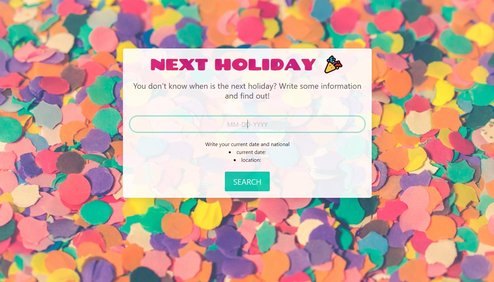

# Holiday
 <h2>Holiday planner</h2>

 Welcome to our first project! 
This time, our team has to show how we work together, and no better way to do it than creating an app that will help you organize your plans in the next holidays acording to your current date.

            <li>
                <a href="#Works">How it works?</a>
            </li>
            <li>
            <a href="#Future Updates">Future Updates</a>
             </li>
             <li>
                 <a href="#contact">Contact</a>
             </li>
           

 

 ## <h2 id="Works"><i> How it works?</i></h2>
 
You'll have to type the date that you want, and it will automaticly deploy what holiday is celebrated that day or the closest holiday of the typed day. It also includes some information about what people usually do on that day

 

 ## <h2 id="Future Updates"><i>Future Updates</i></h2>
 
As you know, it's our first time doing a project in groups. So expect some mistakes or bugs in the app. We'll try to fix them while we learn more in the future but if you want to try it then just click right <a href="" target="_blank">here</a>

 

 ## <h2 id="contact"><i>Contact information</i></h2>

Here are links to find us or if you want to get in contact with us

<li><a href="https://github.com/ahmadkane93" target="_blank">Ahmad Kane</a></li>
    <li><a href="https://github.com/slawless08" target="_blank">Samuel Lawless</a></li>
    <li> <a href="https://github.com/sissyhanks" target="_blank">Bernie Mcknight</a></li>
     <li> <a href="https://github.com/bruno192000" target="_blank">Bruno Calderon</a></li>